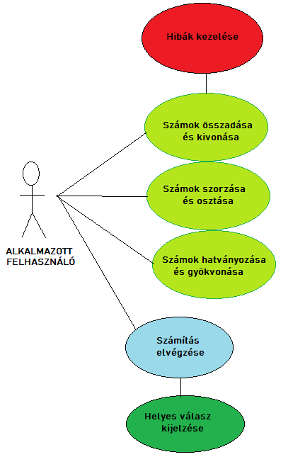

# Rendszerterv

Az alábbi specifikáció tartalmazza az Önök által megálmodott rendszert, amely leírja, hogy
mit (rendszer), miért (rendszer célja), hogyan (terv), mikor (időpont) és miből
(erőforrások) akarunk a jövőben létrehozni. 

A fejezetek részletes tájékoztatót nyújtanak az elképzeléseinkről az Önök specifikációja alapján.

A specifikáció tartalmazza a rendszerterv egyes fontos modelljeit (üzleti, adatbázis) valamint különböző leírásokat.

A dokumentum az Önök leírása alapján jött létre a lehető legnagyobb lefedettséggel amit kívánnak.

## Üzleti folyamatok modellje

A rendszer üzleti modellje tartalmazza mindazon műveleteket amelyeket a felhasználó végre tud majd hajtani,
és azon lehetőségeket amelyekkel kapcsolatot tud teremteni a szoftverrel.

A következő műveletek lehetségesek:
- Műveletek végrehajtása
- Nincs közvetlen elérése a hibakezeléshez.
- A számítás végrehajtása után a felhasználó számára biztosított az eredmémy megjelenítése. 

A lent megjelenített ábra vizuálisan tartalmazza ezeknek a folyamatoknak egy gráfos ábrázolását.

A közvetlen elérhető modulok nyíllal kapcsolódnak egymáshoz.
 

  

## Funkcionális terv

A funkcionális tervezet alapján a jogosultságok és modulok elérése van szerepkörökre bontva.
A termék felhasználása szempontjából egy jogosultság és szerepkiosztás társul, valamint a számológép:

### Felhasználó

A felhasználó képes kezelni a szoftver teljes egészét.
Az alábbi szempontok elérhetőek számára:
- Számok összeadásának bevitele
- Számok kivonásának bevitele
- Számok szorzásának bevitele
- Számok osztásának bevitele
- Törlés

Miután a felhasználó az adott műveleteket elvégezte az egyenlőségjel lenyomásával látni fogja az eredményt megjelenítve.

### Számológép

A bemenetén kapott számokra és operátorokra elvégzi az aritmetikai műveleteket.
Miután elvégezte a számításokat megjeleníti a felhasználó számára az eredményt a kijelzőn.
=======
<h2>Fizikai környezet</h2>
<ul>
<li> Az számológép a könnyű hozzáférhetőség és gyors működés érdekében több operációs rendszer környezetében is futtatható alkalmazás lesz</li>
<ul>
    <li>Windows környezet alatt</li>
    <li>Linux környezet alatt</li>
    </ul>
<li>Ajánlott Architektúrák:</li>
    <ul>
    <li>ARM</li> 
    <li>ARM64</li>
    <li>x64</li>
    <li>x86</li>
    </ul>
<li> Csak saját komponenseket használunk fel</li>
<li>Fejlesztői eszközök:</li>
<ul>
    <li>Visual Studio</li>
    <li>Intellij</li>
    <li>Github</li>
    <li>Trello</li>
    </ul>
</ul>
<h2>Implementációs terv</h2>
<ul>
<li>Az alkalmazás megirásához a Java programozási nyelvet használjuk fel. Ennek főbb okai:</li>
<ul>
<li>A Java egy moduláris nyelv, megkönnyíti a csapatban való munkát
<li>Platform független. Működik bármilyen operációs rendszeren, ha azon van egy JVM (Java Virtual Machine)
<li>Objektum orientált
</ul>
<li>A számológép kinézetét JavaFX Scene Builderrel valósítjuk meg</li>
<ul><li>A kinézet a Funkcionális specifikációban megaddottak alapján fog kinézni</li></ul>
<li>A programban osztályok segítségével jutunk el a célhoz
</ul>

## Tesztterv

1. **Tesztelés elvei:**
- A teszteléseink során szeretnénk meggyőződni arról, hogy az elkészült programunkban nem található hiba. Ez az elv nagyon fontos számunkra, ezért a követelmény listában is szerepel. 
- Fontos ,hogy az kapott eredmény mindig pontos és hibátlan legyen, elveink alapján a legapróbb hiba sem engedhető meg eme projektben.

2. **Tesztelés folyamata:**
- Manuális tesztelés
- Unit tesztelés

3. **Tesztelés kontrollja:**
- Kontrollként több netes számológépet illetve fizikai számológépet fogunk használni, ezzel is bebiztosítva azt ,hogy a kapott eredmények hibátlanok és pontosak.

4. **Tesztesetek:**
- Pozitív számok összeadása
- Pozitív számok kivonása
- Pozitív számok szorzása
- Pozitív számokkal osztás
- Pozitív számokkal való gyökvonás
- Pozitív és negatív számok összeadása
- Pozitív és negatív számok szorzása
- Negatív számok kivonása
- Negatív számokkal való osztás
- Negatív számokkal való gyökvonás
- Negatív számok összeadása
- Negatív számok szorzása
- Nulla és pozitív szám összeadása
- Nulla és negatív szám összeadása
- Nullával való osztás
- Nullával való szorzás
- Nullával való gyökvonás

5. **Sikeres teszt kritériumai:**
- A program akkor megy át a teszteken, ha eredményei megegyeznek az elvártakkal, illetve a kontroll eszközökön kapott eredményekkel. 

## Telepítési terv

A kész projektből generálunk egy .jar fájlt, melyből konvertálunk egy .exe fájlt, ezáltal az end-user-nek nem lesz más dolga ,mint a .exe fájlt elindítani és használható is az alkalmazás. 
Forrás: ( https://www.genuinecoder.com/convert-java-jar-to-exe/ )

## Karbantartási terv
A projekt elkészítése során figyelünk arra ,hogy a függőségek megadása során pontos verziószámokat használjunk. Ezáltal elkerülve az eshetőséget arra ,hogy a programunk ne tudjon megfelelően funckcionálni, ha a verzióváltás során az adott függősén belül minket érintő változás történne. 

## A rendszer célja

Az általunk létrehozni kívánt rendszer célja, hogy az Önök elvárásait elégítse ki a lehető legnagyobb mértékben.
Ennek a rendszernek a céljai a következők:
- Egy egyszerűbb matematikai műveletet megoldó hatékony rendszer megvalósítása.
- Az Önök által elképzelt számológépet létrehozni mint kinézetre, mint működésre.
- Helyes, pontos működés biztosítása.
- Minden említett művelet pontos és helyes megvalósítása.
- Önök jelenlegi helyzetét a kívánt helyzetté alakítani.

## A rendszer követelményei

A rendszer követelményei javarészt az olyan követelményeket foglal magába, melyek megvalósítását megcélozza a rendszerterv.
Ezek a következők:

|Modul| ID | Név |V.| Kifejtés|
|---|---|---|---|---|
|-| K01| Képes osztani|-|A számológép képes az osztás művelet elvégzésére.|
|-| K02| Képes szorozni|-|A számológép képes a szorzás művelet elvégzésére.|
|-| K03| Képes gyökvonásra|-|A számológép képes a gyökvonás művelet elvégzésére.|
|-| K04| Képes hatványozásra|-|A számológép képes a hatványozás művelet elvégzésére.|
|-| K05| Egyszerűen kezelhető rendszer|-|A számológép egyszerűen kezelhető az end-user számára.|
|-| K06| Képes legyen törölni|-|A számológép képes a törlés műveletre.|
|-| K07| Pontosan hibátlanul működjön|-|A számológép hibátlanul működik és pontosan végzi el a műveleteket.|
|-| K08| Egy letisztult, átlátható rendszer|-|A számológép egy letisztult felhasználói felülettel rendelkezzen.|

## Absztrakt domain modell

A rendszer fogalmai:
- Összeadás művelete.
- Kivonás művelete.
- Osztás művelete.
- Szorzás művelete.
- Hatványozás művelete.
- Gyökvonás művelete.

Rendszerünk egy JavaFX alkalmazás, melyben az MVC architektúrát követjük, és a felhasználói felületet FXML-ben hozzuk létre. 
Az MVC architektúra lényege: A rendszer három különböző részre osztható fel, ez a Modell, Nézet, és Vezérlő.
- A modell a rendszer működését tartalmazza, illetve adatokat.
- A vezérlő kapcsolatot teremt a modell illetve a nézet között, információt továbbít a két komponens között.
- A nézet felelős a modellben lévő adat megjelenítéséért.

A rendszer a következőképpen működne egy példa esetben:
- A felhasználó a felhasználói felületen beüt egy számot. Ekkor ezt feldolgozva megjelenítjük a kijelzőn.
- Amint beüt egy műveletet, akkor eldőlt, hogy mi lesz a művelet. Ezt is elmentjük. Ezután következik a második szám beolvasása.
- A második szám beolvasása az egyenlőség gomb megnyomásával ér véget. Ekkor a Vezérlő a Modell segítségével kiszámolja a megadott feladatot, és a visszatérő eredményt a nézet felé továbbítva megjeleníti a kijelzőn.

A rendszer fontosabb komponensei:
- Egy fő komponens, mely az alkalmazás indításáért felelős, és az FXML elindításáért.
- Modellt tartalmazó komponens, mely a Modell részét valósítja meg az alkalmazásnak.
- Vezérlőt tartalmazó komponens, mely a Vezérlésért felelős, a felhasználó által generált eseményekre egy helyes választ adni a modell segítségével.
- Nézetet tartalmazó FXML-t megvalósító komponens.
- Nézetet stilizáló CSS-ben megírt rész.

