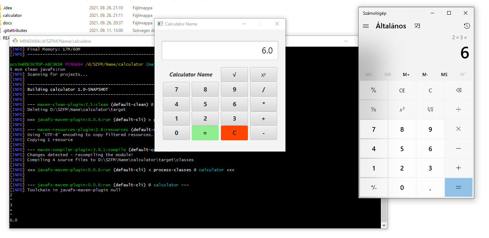
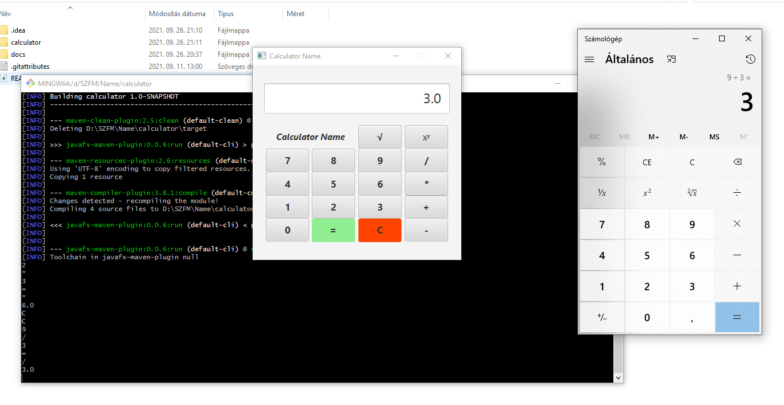
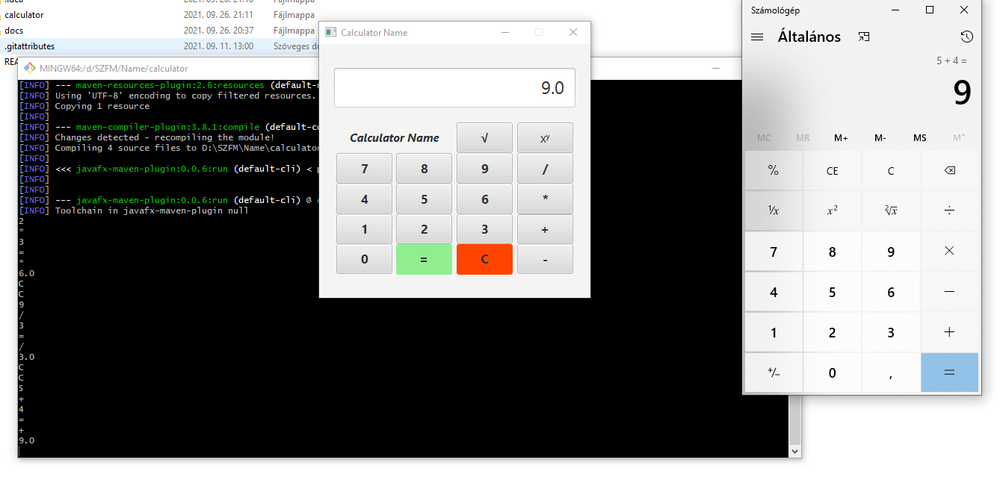
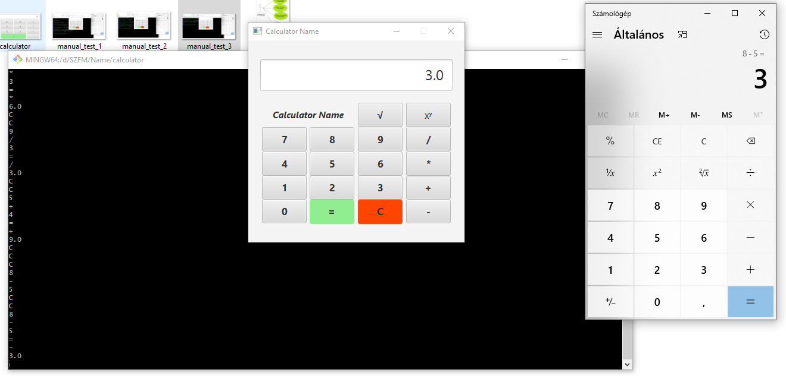
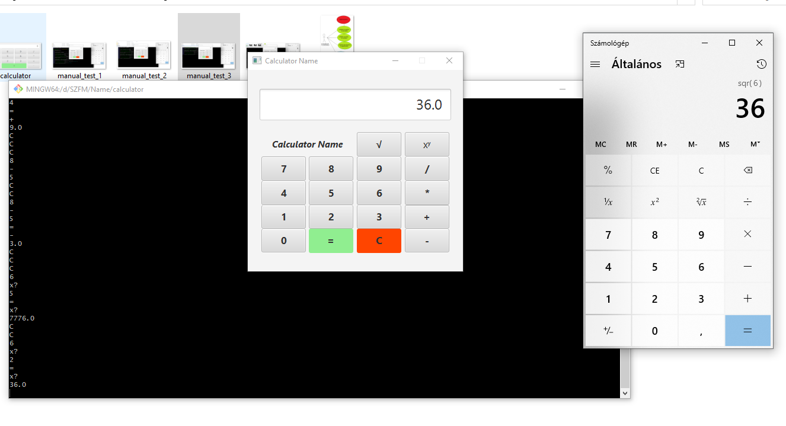
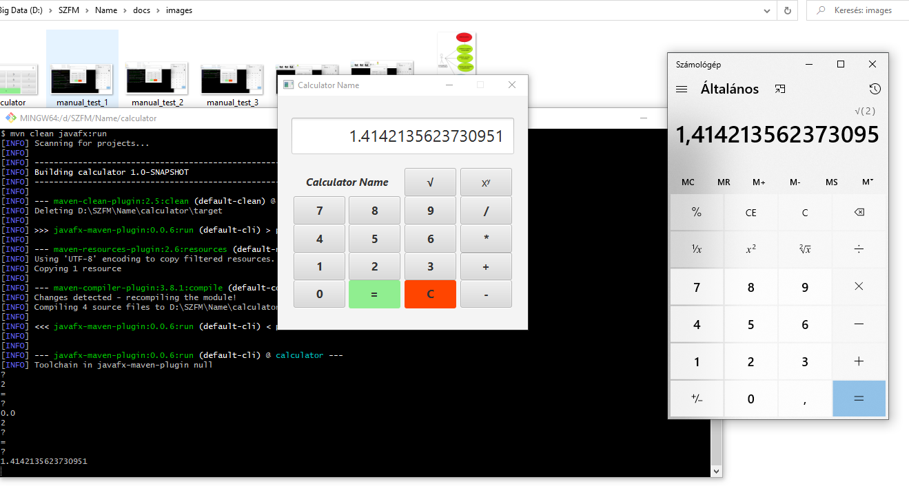

# **Tesztjegyzőkönyv**

## **Backend tesztelés**

A szoftver backend része unit tesztekkel lett ellátva.

A különböző aritmetikai operátorok minden része le lett fedve.

Tesztelve lettek az összeadás/kivonás/szorzás/osztás/hatványozás/gyökvonás operátorok.

Az operátorok bementül kaptak egész illetve lebegőpontos számokat is.

Így az egységtesztelés eredményét tekintve teljes lefedettséget nyújt a programunk a lebegőpontos és az egész számok esetén is. 

## **Elvárások**
Jelen dokumentum célja, hogy az Számológép megvalósítása projektben a program
tesztelési elvárásait ismertesse. \
A projekt sikeres befejezésének eszköze a tesztelési terv és a tesztelési jegyzőkönyvek. A
tesztelési jegyzőkönyvekben részletezett tulajdonságok megfelelése, valamint a
Szerződésben hivatkozott dokumentációk átadása esetén kerül sor a Szerződésben szereplő
végteljesítés-igazolás Végső Kedvezményezett általi ellenjegyzésre. \

Összefoglalásként kiemelhető, hogy akkor tekinthető egy adott részrendszer tesztelése
sikeresnek, ha
- a tesztelési jegyzőkönyvek mezői 98%-ban MEGFELELT minősítésűek, azaz
- a specifikációban elfogadott funkciók működnek (a rendszer az előre definiált
eredményt adja előre definiált bemeneti adatok esetében – funkcionális teszt),
- a rendszerfunkciók specifikált paramétereinek mért értékei az elvárásoknak
megfelelő teljesítmény-határértékek között vannak (mért válaszidő vagy elvégzési
idő kisebb az előre definiált válasz- vagy elvégzési időnél – terheléses teszt).
- a manuális tesztek során legalább 98%-ban MEGFELELT a program

## *Tesztelés menete*

### *Rendszerteszteléshez kapcsolódó határidők*
| *Sorszám* | *Tevékenység részletezése* | *Határidő* |
| ----------- | ----------- | ----------- |
| 1.| A kifejlesztett funkcionalitás szállító oldali tesztelésének lezárása, az átadás-átvételi folyamat megkezdése.  | - |
| 2.| A rendszerek átadás-átvételi folyamatának lezárása. (Rendszerspecifikus átadás-átvételi tesztek elvégzése, eredmények ellenőrzése és ellenjegyzése.)  | - |
| 3.| A kifejlesztett funkcionalitás éles üzembe állítása | - |

## *Tesztelési folyamat leírása*

A tesztelési folyamat váza:
- előzetes tesztek validálása, elfogadása: termék megfelelőségek vizsgálata, összevetés az
adott specifikációkkal (amennyire lehet, ki kell terjednie a felhasznált eszközök szintjére),
- tesztelési folyamatok ellenőrzése, elfogadása
- tesztek műszaki kiértékelése – a kapott eredmények megfelelősségének vizsgálata.

A jelenlegi projektben kialakított rendszerek tesztelését szoftverfejlesztői csapat végzi. A tesztelési tervek kitérnek az elvégezendő fejlesztői, felhasználói, funkcionálási és egyéb tesztek folyamatára, ütemezésére. \
A tesztelés jelen projektben funkcionális tesztelést jelent. \ 
A tesztek fő szempontja funkcionális és technikai ellenőrzés, melyeket
követően a szükséges javítások elvégzésére kerül sor. A tesztekről tesztelési jegyzőkönyvek
készülnek.
Az átadás-átvételi tesztek megkezdését kezdeményezni a sikeres, előzetesen Végső
kedvezményezettnek átadott és előzetesen egyeztetett tesztelési metódus alapján végzett vállalkozói
tesztelési jegyzőkönyvek birtokában lehetséges. \
Az átadás-átvételi tesztek lebonyolítása Végső kedvezményezett minőségbiztosítójának a feladata, itt
a Vállalkozó részéről csak a tesztekben való közreműködés és a feltárt hibák elhárítása az elvárt. A
teszteket a Minőségbiztosítási tervnek megfelelően kell elvégezni. \
Az átadás-átvétel akkor tekinthető sikeresnek, ha az átadás-átvételre felajánlott rendszerek a
Rendszertervekben, valamint a Minőségbiztosítási tervben foglalt feltételeknek megfelelnek.

## **Manuális tesztelés**

A manuális tesztelés alatt a Microsoft beépített számológépét vettük referenciaként. \
*A projekt 100%-osan átment a manuális teszteken.*
### Szorzás manuális tesztelése

### Osztás manuális tesztelése

### Összeadás manuális tesztelése

### Kivonás manuális tesztelése

### Hatványozás manuális tesztelése

### Gyökvonás manuális tesztelése

